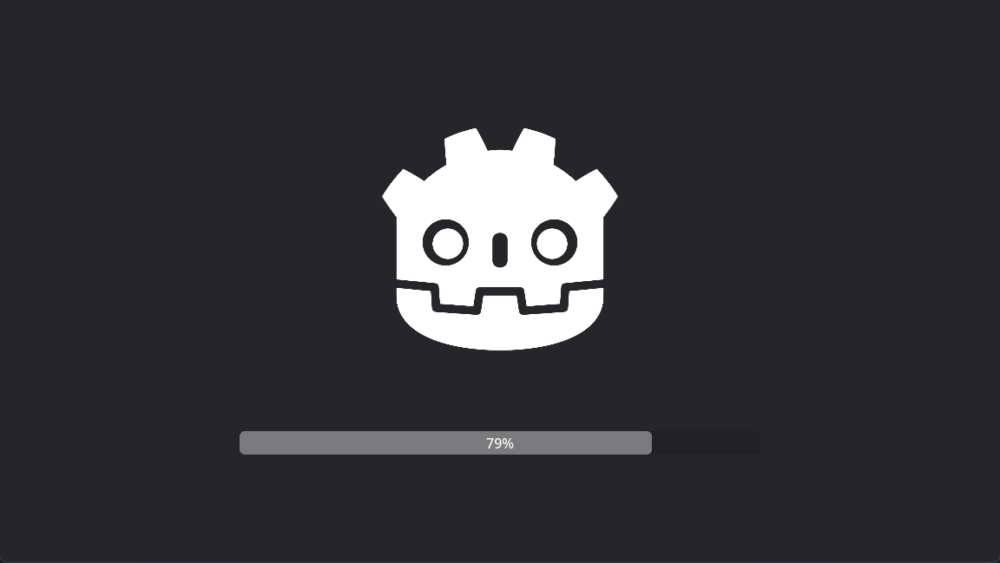

# Most Simple Scene Loader

A basic straightforward scene loader with a loading screen for quick setup. Very simple and featureless. Ideal for rapid development and early project stages. Just a few files to begin with.

## Contains
- loading script with single public method
- loading scene with animation player and progress bar

## Contains Not
- documentation and code comments
- plugin files and configs
- example files
- project settings references
- absolute paths to non-existent resources
- hidden functionality and implicit behaviour

## Installation
1. Obtain the [asset](https://godotengine.org/asset-library/asset/3128) from the Godot Asset Library or [download](https://github.com/MikeAmputer/godot-simple-scene-loader/archive/refs/heads/master.zip) from github
2. Add the `loading.tscn` scene as a singleton in the autoload settings (for more details, refer to the [Godot documentation on singletons](https://docs.godotengine.org/en/stable/tutorials/scripting/singletons_autoload.html))

## Usage
Use the singleton function `Loading.load_scene`, assuming `Loading` is the name you assigned to your singleton.
The function includes two parameters:
- `path: String`: The path to the scene that you want to load, e.g., `"res://Scenes/main_menu.tscn"`
- `use_transition_scene: bool`: Determines if a loading screen should be used during the transition. This is optional and defaults to `false`

## Customization
This asset is made for quick integration, eliminating the need for detailed documentation. Simply explore the code to grasp its features and adapt it to your project.

## Included Scene Preview

    

