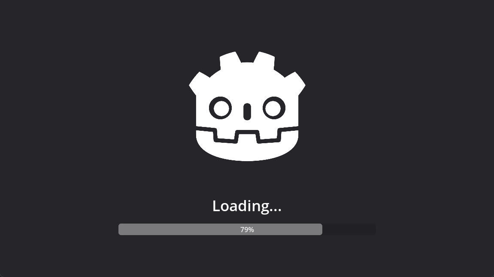

# Most Simple Scene Loader

A basic straightforward scene loader with a loading screen for quick setup. Very simple and non-extensible. Ideal for rapid development and early project stages.

## Contains
- loading script
- loading scene with animation player and progress bar

## Installation
1. Obtain the asset from the Godot Asset Library.
2. Add the `loading.tscn` scene as a singleton in the autoload settings (for more details, refer to the [Godot documentation on singletons](https://docs.godotengine.org/en/stable/tutorials/scripting/singletons_autoload.html))
4. Use the singleton function `Loading.load_scene`, assuming `Loading` is the name you assigned to your singleton

## Usage
The `load_scene` function includes two parameters:
1. `path: String`: The path to the scene that you want to load, e.g., `"res://Scenes/main_menu.tscn"`
2. `use_transition_scene: bool`: Determines if a loading screen should be used during the transition. This is optional and defaults to `false`

## Customization
This asset is made for quick integration, eliminating the need for detailed documentation. Simply explore the code to grasp its features and adapt it to your project.

## Included Scene Preview

    

